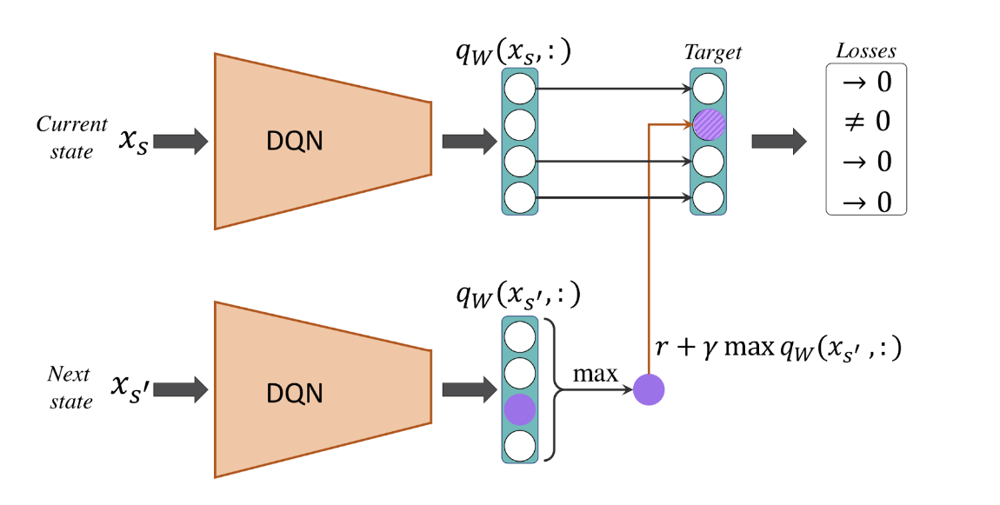
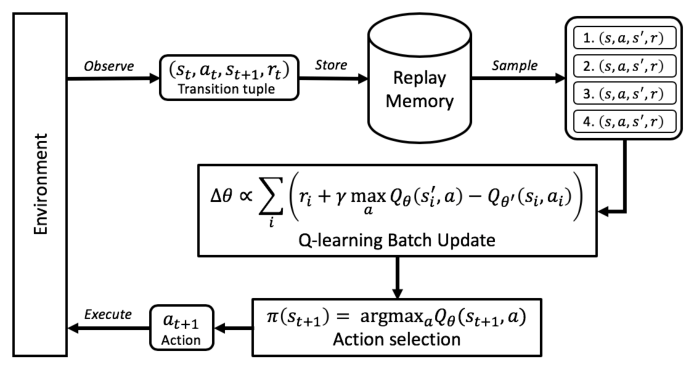

# Stock-Trading-with-Deep-Q-Network
-- Yuanshan Zhang, Mengxin Zhao, Jinke Han

## Introduction
Reinforcement learning is the state of art and most current AI research are focused on RL. It also succeeded in many real-world applications. For instance, auto-driving, the well-known Alpha Go, strategic gaming, and also stock trading. It is substantially different from supervised and unsupervised learning, and is regarded as the ‘third category of machine learning’ because in reinforcement learning, the agent learns by interacting with the environment.

DQN (Deep Q Network) is a combination of model-free reinforcement learning and deep neural network. DQN is suitable for tasks with large or continuous state or action space or when environment dynamics are indeterministic (reason for being a model-free algorithm). Therefore, using the action value function Q(s,a) enables the algorithm to learn the best policy directly from the action without the necessity of the full knowledge of the environment dynamics. 

DQN is therefore suitable in trading scenarios since the state space is large (the stock market is changing every second) and the full knowledge of the environment dynamics is impossible to gain (no one knows what tommorrows’ stock market will look like).

## What I did
First, I define the following terminologies according to my purpose:
- Agent: the algorithm that can be trained to choose the optimal actions at each state to maximize the total rewards
- Environment: a stock trading simulation with which the agent can interact
- A (Action): hold, buy, and sell
- R (Reward): positive R when profit > 0, negative R when profit < 0
- S (State): stock info (given by a sliding window), balance, position, profits
- Episode: $S_0, A_0, R_1, S_1, A_1, R_2, \ldots, S_t, A_t, R_{t+1}, \ldots, S_{T-1}, A_{T-1}, R_T, S_T$

The building of the DQN model consists of 4 major parts: 1. Environment  2. Model (MLP & LSTM) 3. Replay Memory 4. Agent

**1. Environment**\
First, an environment is built using the OpenAI gym to simulate stock trading. The environment consists of 3 crucial methods: 1. reset() 2. get_observation() 3. step() 4. render()

- the reset method restores the environment to the initial state at the beginning of a new episode
- the get_observation method concatenates the state information
- the step method assigns rewards and returns 3 components of the transition quintuple: next_state, reward, and done (if an episode is done or not). The render method renders real-time information to the screen

The functionality of the environment was tested using a subset of the data (see notebook for details)

**2. Model**\
An LSTM is used to estimate the Q function by using the current state as input. However, like mentioned above, since the environment dynamics is indeterministic, the ground truth of Q function can only be approximated. In reinforcement learning, approximating the target is called ‘bootstrapping’. The target Q is bootstrapped by using the same network but with the next state as input and less frequent network parameters update.

**3. Replay Memory**\
Since we are now approximating the Q with a MLP model, updating the weights for a state-action pair will affect the output of other states as well. When training NNs using stochastic gradient descent for a supervised task (for example, a classification task), we use multiple epochs to iterate through the training data multiple times until it converges. This is not feasible in Q-learning, since the episodes will change during the training and as a result, some states that were visited in the early stages of training will become less likely to be visited later.

Furthermore, another problem is that when we train an NN, we assume that the training examples are IID (independently and identically distributed). However, the samples taken from an episode of the agent are not IID, as they obviously form a sequence of transitions.

To solve these issues, as the agent interacts with the environment and generates a transition quintuple, we store a large (but finite) number of such transitions in a memory buffer, often called replay memory. After each new interaction (that is, the agent selects an action and executes it in the environment), the resulting new transition quintuple is appended to the memory.

To keep the size of the memory bounded, the oldest transition will be removed from the memory . Then, a mini-batch of examples is randomly selected from the memory buffer, which will be used for computing the loss and updating the network parameters.

**4. Agent**\
The agent estimates the Q values for each action at each state using trained model, and choose the action with the highest Q value. Moreover, to let the agent fully explore different strategies during early stages of episodes in the training process, $\epsilon$-greedy policy is applied to give small chances to non-optimal actions to be chosen by the agent, and the chances decrease with time. However, agent will only take deterministic actions (i.e. not using $\epsilon$-greedy policy) on the test data.

**5. Trainer**\
The trainer estimates Q and target Q through the models and update gradients via backpropagation.
